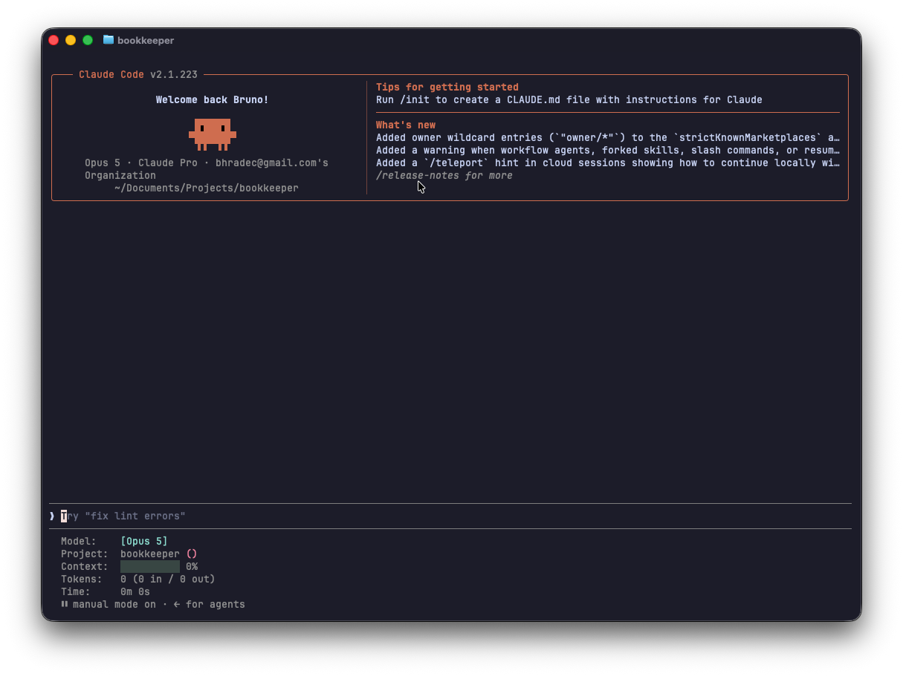

# Claude Code Statusline

To install, add the config from `settings.json` to your `~/.claude/settings.json`.

Then copy `statusline.sh` to `~/.claude`.

Restart Claude Code CLI and the statusline should work.
